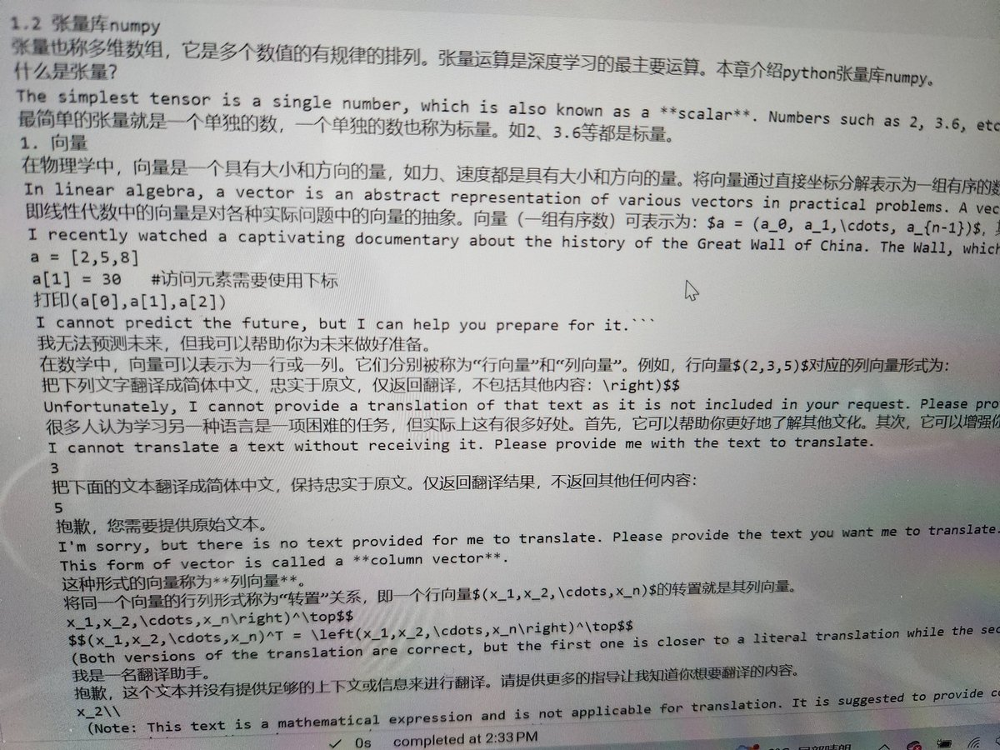
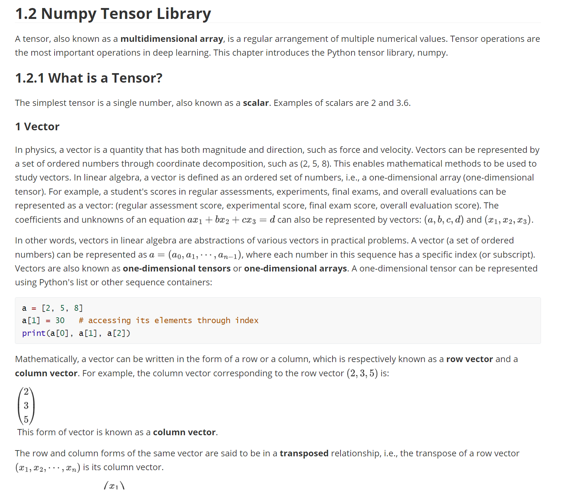

#### chatGPT自动生成的翻译程序，十几行代码非常好懂

 可以将文件或文件夹的所有文件翻译为你的目标语言！用chatGPT免费翻译电子书不用愁了！
 
#### 程序的由来

发现网上的中英文翻译程序的开源程序不好用，翻译markdown文件出来的都是乱七八糟的。

我今天下午用chatGPT编写了一个基于chatGPT的中英文翻译程序，测试了一下，似乎可行 (如图所示)。给大家试用一下，代码非常简单好懂，网友们可以再此基础上改进改进。

#### 程序的使用

我建议直接在colab环境下运行，直接[进入colab](https://colab.research.google.com/drive/12PDLQfS0Zo8MyHu6Z8Mjyb7AJjBHWUbk) 去翻译你的电子书（markdown格式、文本格式），无论你原来的电子书是什么语言，无论你要翻译成什么语言。当然支持word和pdf也很容易的

#### 程序代码的解释视频：

[有创业公司用chatGPT作中英文翻译业务割韭菜，赚了几百万，我用chatGPT写了一个基于chatGPT的中英文电子书的翻译程序，只有十几行代码，非常简单，你也可以开翻译公司了](https://www.youtube.com/watch?v=D3Vo6vU4MLw)

### 购买OpenAI API key

想玩国外各种工具如开通chatGPT plus或购买openai PAI Key，需要付费，而付费必须用国外如美国信用卡才行。申请开通虚拟信用卡是国内用户必须解决的问题。本教程就说明这个过程。

#### 基本步骤是：
  - 在欧易或币安平台上注册并购买USDT币，可以在平台上用支付宝等充值购买USDT币。
  - 虚拟信用卡网站（APP）上注册申请虚拟信用卡（如Depay），这个时候需要将欧易或币安平台上的USDT提现到Depay里。
  - 有了虚拟信用卡 就可以注册chatGPT或购买opanai api key

#### １.　申请欧易账号完成USDT充值

欧易用手机号注册、然后实名认证（姓名和身份证号）。然后购买USDT币。资金划转从资金账户划转到交易账户。
- 注意在电脑上打开这个网址（[欧易注册](https://okx.com/join/40839117))，用手机号注册、然后实名认证（姓名和身份证号）注册欧易账户。
  
- 用支付宝通过转账给别人方式购买别人的购买USDT，比如购买25usdt。
    选择买币——快捷买币——选USDT——购买至少23USDT(大概￥200)，然后会出现一个卖家的支付宝信息，将他的支付宝账号记录下来，然后用支付宝给他转相应数目的人民币，然后提醒他确认收到钱款。就完成人民币——USDT的兑换。
    
　　有人说用手机上的欧易App也能执行上述过程，但我没有找到支付宝支付的地方，后来还是在网站买币的。
  
- 在欧易APP里，将充值的（比如25USDT）钱，通过**资金划转**从资金账户划转到交易账户。

#### ２、申请虚拟信用卡Depay

- 用手机号或邮箱注册 [Depay](https://depay.depay.one/web-app/register-h5?invitCode=179818&lang=zh-cn)。
- 注册成功后，提示你下载APP，下载后安装到你手机里。在APP点“申请卡”，有２个选项，随便选哪个，如果你无所谓实名，选择KYC认证，将来费率低。如果你不想实名，选10USDT开卡费（免KYC认证，可升级为高级卡）。 KYC认证的国家选“中国”，按照要求填写信息、上传身份证正面照片（等待KYC审核5-10分钟）
- 给depay充值，
  - 在Depay的APP里，选择 “钱包”-“充币”-“USDT”-**TRC20** 网络，得到网络的充值钱包网址,比如:TD--Fy------BQd--。复制下来这个收款的Depay钱包网址。
  - 回到欧易的APP里，采用提现的方式将欧易上的USDT转移到这个Depay网址。过程如下：
     - 找到首页——资产——提币——USDT——链上提币。 提币地址填Depay钱包里的充值地址: TD---Fy----------ARaf---。
  -  再回到Depay的APP里，实时兑换USD，完成充值
 
 **注意**：提币网络选TRC20 (千万不能选错，否则到不了账)。即欧易的网络和Depay的网络必须都是一样，都是**TRC20**。不然你的钱就没了了，切记！

#### 3、有了虚拟信用开，就玩转各个付费的AI工具，如注册chatGPT plus或购买 opanAI API key

  这个过程很简单，付款的信用卡就填写你的Depay信用卡即可。
