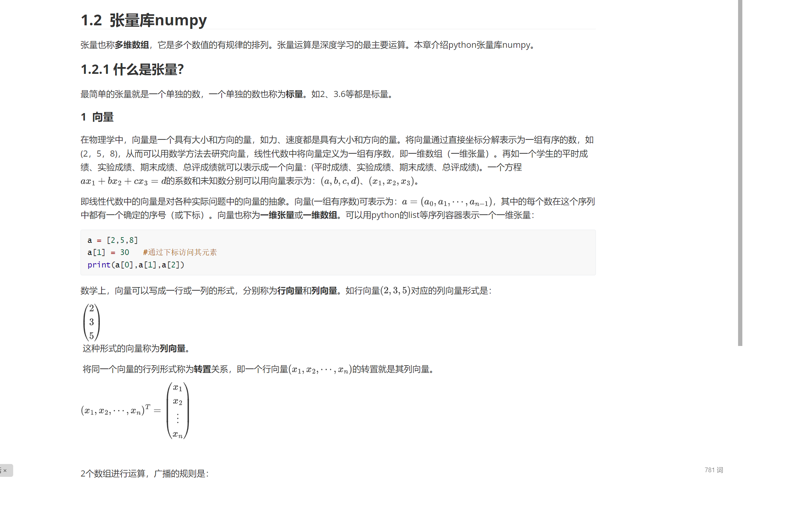

#### chatGPT自动生成的翻译程序，十几行代码非常好懂

 可以将文件或文件夹的所有文件翻译为你的目标语言！用chatGPT免费翻译电子书不用愁了！
 
#### 程序的由来

发现网上的中英文翻译程序的开源程序不好用，翻译markdown文件出来的都是乱七八糟的。

我今天下午用chatGPT编写了一个基于chatGPT的中英文翻译程序，测试了一下，似乎可行 (如图所示)。给大家试用一下，代码非常简单好懂，网友们可以再此基础上改进改进。

#### 程序的使用

我建议直接在colab环境下运行，直接[进入colab](https://colab.research.google.com/drive/12PDLQfS0Zo8MyHu6Z8Mjyb7AJjBHWUbk) 去翻译你的电子书（markdown格式、文本格式），无论你原来的电子书是什么语言，无论你要翻译成什么语言。当然支持word和pdf也很容易的

#### 程序代码的解释视频：

[有创业公司用chatGPT作中英文翻译业务割韭菜，赚了几百万，我用chatGPT写了一个基于chatGPT的中英文电子书的翻译程序，只有十几行代码，非常简单，你也可以开翻译公司了](https://www.youtube.com/watch?v=D3Vo6vU4MLw)

### 申请openai api key

 发现了这个文章[国内开通Chat GPT Plus保姆级教程](https://chatgpt-plus.github.io/chatgpt-plus/)，不知道是否有用？
 
 2. 欧易用手机号注册、然后实名认证（姓名和身份证号）、然后购买USDT币。注意在这个网址（[https://www.okx.com/cn](https://www.okx.com/cn)）上而不是APP上
 3. 用手机号或邮箱注册 [Depay](https://depay.depay.one/web-app/register-h5?invitCode=920750&lang=zh-cn)。注册成功后，提示你下载APP，下载后安装到你手机里。在APP的右上角开通卡，选10USDT开卡费(一次性)（据说不要KYC认证）
